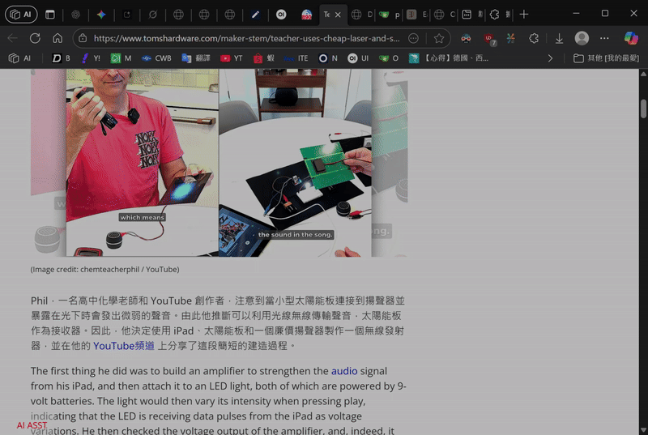

# LLM Sidebar

A Chrome extension that adds a sidebar for summarising, translating any web page with a large‑language‑model provider of your choice (OpenAI, Google Gemini, Ollama, etc.).

## Features

- **Side‑panel UI** that lives in the browser’s right edge.
- **Provider selector** – pick the LLM you want to use. API key & base URL store per‑provider credentials in Chrome’s secure storage.
- **Summarise** - Summarise the web page.
- **Translate**: Translate the web page .
- **Chat & export chat history**: Chat with LLM server and export the chat history.

## DEMO




## Install / Dev

```bash
# Clone repository
git clone https://github.com/Owen-Peng1206/llm_sidebar_extension.git
cd llm_sidebar_extension

# Install deps
npm install

# Build extension for production
npm run build

# Or start dev server (not a full extension dev environment)
npm run dev
```

Load the `dist/` folder into Chrome/Edge:

1. Open `chrome://extensions/` or `edge://extensions/` 
2. Enable “Developer mode”
3. Click “Load unpacked” → choose `dist/`

## Project Structure

```
my-extension/
├─ src/
│   ├─ background/
│   │   ├─ background.ts
│   │   ├─ types.ts
│   │   ├─ storage.ts
│   │   └─ providers/
│   │       ├─ OpenAI.ts
│   │       └─ Ollama.ts
│   │       └─ GoogleGemini.ts
│   ├─ content/
│   │   └─ contentScript.ts
│   ├─ utils/
│   │   ├─ extract.ts
│   │   └─ chunk.ts
│   └─ ui/
│       ├─ sidebar/
│       │   └─ index.html
│       │   └─ sidebar.js
│       │   └─ markdown-it.min.js
│       └─ options/
│           ├─ options.html
│           └─ options.js
├─ public/
│   └─ icons/
│       ├─ icon-48.png
│       └─ icon-128.png
└─ dist/
```

## Adding a new provider

Create a new file in `src/background/providers/`, export a `Provider` object, and register it in `background.ts`.  The provider must implement `sendPrompt(prompt: string): Promise<string>`.

## License

MIT